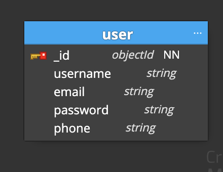

# food-app
react  node.js express

### commit message format
> https://www.freecodecamp.org/news/how-to-write-better-git-commit-messages/

### user schema
> 

### user path
> http://localhost:8080/api-docs/

### backend validation library: Joi 
> https://www.npmjs.com/package/joi

### manage database
> mongoose

### Authentication with next-auth
> 1. npm install next-auth ([text](https://next-auth.js.org/getting-started/example))
> 2. This project is Next.js 14.2.8, following this guid ([text](https://next-auth.js.org/configuration/initialization#route-handlers-app))
> 3. [...nextauth]: is a catch-all route in Next.js that handles all paths for NextAuth's authentication API, this file handles all of
the following URLs: 
/api/auth/signin
/api/auth/signout
/api/auth/callback
/api/auth/session
/api/auth/providers
etc.

> 4. setting up OAuth consent screen (https://console.cloud.google.com/apis/credentials/consent?project=mythic-plexus-394815)

> 5. setting up OAuth client ID: OAuth protocol(allow user login Food-App via Google or Twitter application)
get: 
    GOOGLE_CLIENT_ID=74351195804-ci3mc8ekdkbj6jgpjf87esdmvpb2bj9t.apps.googleusercontent.com
     GOOGLE_CLIENT_SECRET=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

> 6. Create Google Provider in route.ts ([text](https://next-auth.js.org/providers/google))

> 7. Navigation
<Link href='/api/auth/signin'>Login</Link>
'/api/auth/signin' is 'next-auth' api

> 8.1 accessing sessions on the client (navigation bar -> client part)
add SessionProvider in Root Layout
useSession to get user data(information)

> 8.2 accessing sessions on the server
getServer in (home page -> server side)

